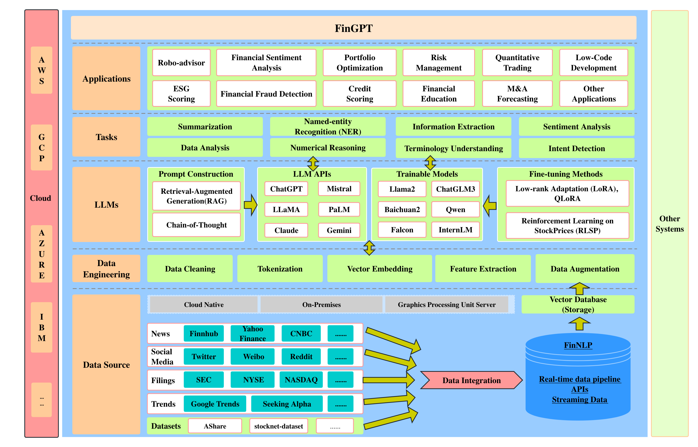
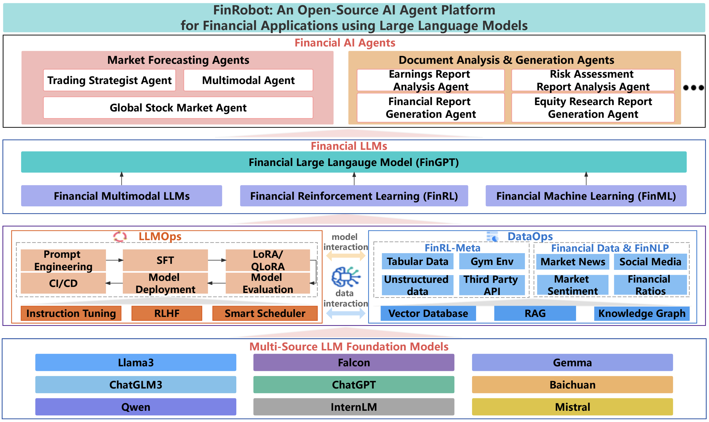

## What are Large Language Models (LLMs) in Finance?

Large Language Models (LLMs) are AI-powered deep learning models trained on massive datasets to process and generate human-like text. They use natural language processing (NLP) to interpret financial documents, market trends, and sentiment analysis in real time. 

### Key LLM Features in Finance:

1. **Financial Sentiment Analysis**
Analyzes sentiment in news, reports, and opinions to understand market trends, investor confidence, and sentiment-driven investment opportunities, enabling informed financial decisions and strategic planning.

2. **Risk Assessment and Fraud Detection**
Identifies anomalies in transactions or investments, leveraging AI to detect fraud and assess risks, improving security and compliance in financial operations while safeguarding stakeholders.

3. **Automated Financial Reporting**
Generates concise summaries of earnings, stock performance, and investments, reducing manual effort and ensuring consistent, real-time, and accurate financial communication across stakeholders.

4. **Chatbots and Virtual Assistants**
AI-driven chatbots provide instant, personalized financial advice, answer customer queries, and streamline service interactions, enhancing customer satisfaction and operational efficiency for financial institutions.

5. **Predictive Analytics**
Forecasts market trends, stock movements, and economic changes using historical and real-time data, empowering finance professionals to make proactive, data-backed investment and business decisions.

### Top Financial Large Language Models (LLMs)

1. **FinGPT**
An open-source financial LLM designed for tasks like sentiment analysis and market forecasting. FinGPT can be fine-tuned swiftly to incorporate new data, making it adaptable to the dynamic nature of financial markets.

2. **FinRobot**
An AI agent platform that integrates various AI technologies for financial applications, extending beyond language models. It offers tools for market forecasting, document analysis, and trading strategies.

3. **BloombergGPT**
A 50-billion parameter LLM trained on a vast range of financial data, supporting diverse natural language processing tasks within the financial industry. It assists in improving tasks such as sentiment analysis, named entity recognition, news classification, and question answering.\

[source*](https://arya.ai/blog/5-best-large-language-models-llms-for-financial-analysis#:~:text=What%20are%20Large%20Language%20Models,sentiment%20analysis%20in%20real%20time)